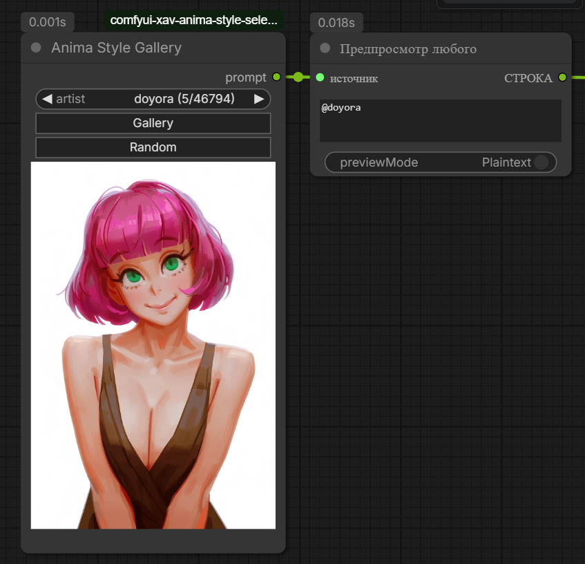
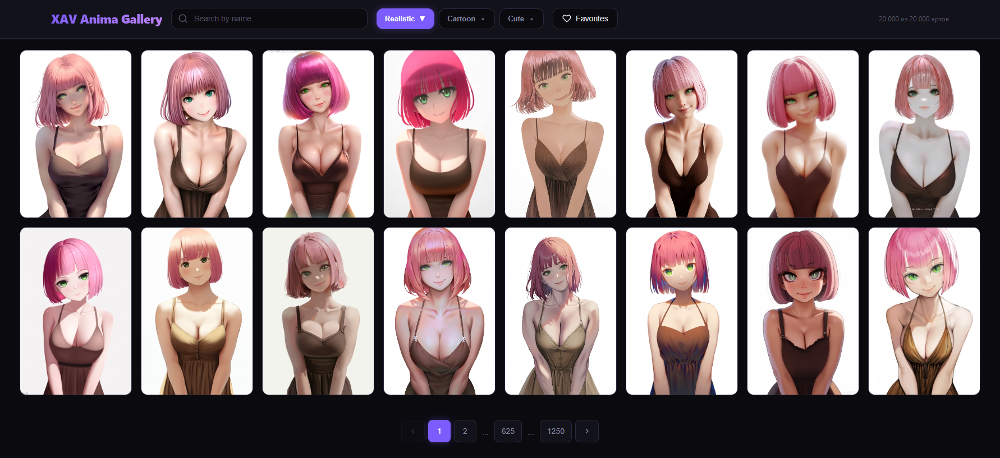
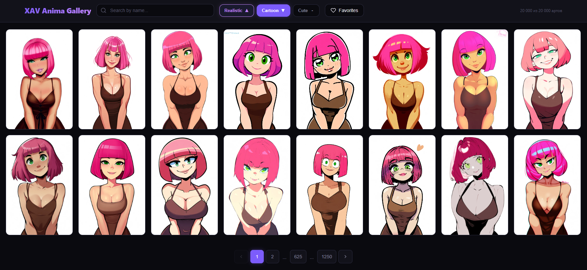
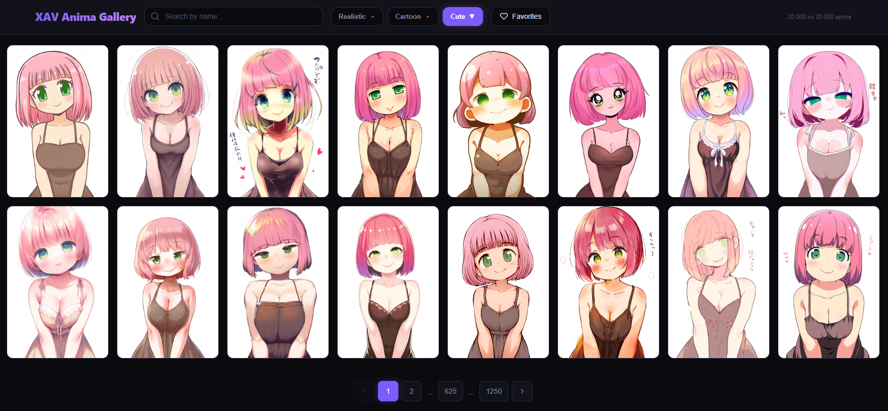
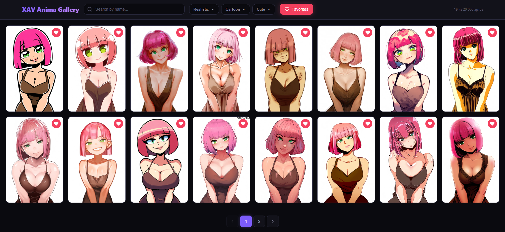
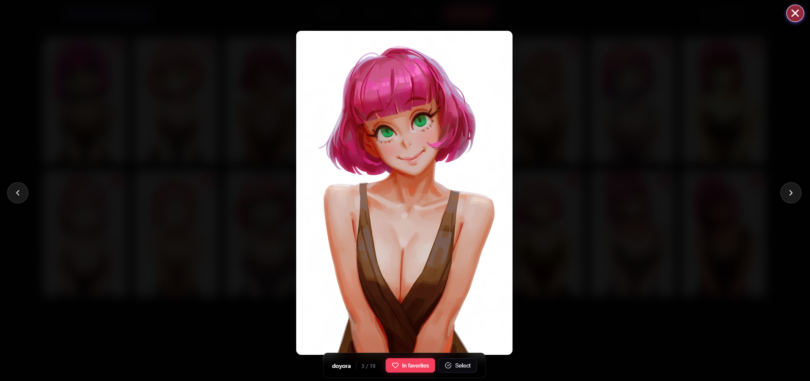
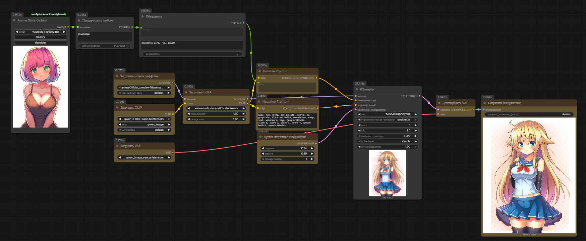

# 🎨 ComfyUI XAV Anima Style Selector

  <i>ComfyUI nodes for quick and easy style selection for the Anima model</i>

  
  
  

---

**Choose from 20 000+ styles – instantly, without loading a single LoRA.**  
This custom node lets you visually browse, search, sort, and select a style from the massive Anima style database. It outputs the style name directly into your prompt, where the Anima model understands it perfectly.

---

## ✨ Features

- 🖼️ **Visual style preview** directly on the node
- ⏩ Quick **next/previous** buttons for fast browsing
- 🎲 **Random style** button for creative surprises
- 🖼️ **Full‑screen lightbox** – preview styles large, navigate with arrow keys or buttons
- 📂 **Style gallery** with:
  - Sorting by **Realistic**, **Cartoon**, **Cute** (estimated by a neural‑assisted pipeline)
  - 🔍 **Search** by style name
  - ⭐ **Favorites** system
- 📤 Outputs plain text – insert anywhere in your prompt (e.g. with a `String` or `CLIP Text Encode` combine node)
- 🧪 **Example workflow** included in the `workflows/` folder

> Think of it as a gallery of 20 000 LoRAs – but you never need to download or load them.

---

## 📸 Screenshots

### 🧩 The node in action

  

### 📊 Sort styles by Realistic / Cartoon / Cute

  
  
  

### ⭐ Favorites & Lightbox preview

  
  

### 🔧 Workflow example

  

---

## 📦 Installation

### Via ComfyUI Manager (recommended)
1. Open ComfyUI
2. Go to **Manager → Install Custom Nodes**
3. Search `comfyui-xav-anima-style-selector` and install
4. Restart ComfyUI

No extra Python dependencies are required.

---

## 🚀 Usage

1. Add the **“Anima Style Selector”** node to your workflow.
2. Use the **◀ ▶** buttons or the **random** button to pick a style, or click **“Open Gallery”** for full search/sort/favourites.
3. The node outputs the style author name as a string.
4. Feed that string into your prompt – for example, combine it with a `CLIP Text Encode (Prompt)` node: masterpiece, best quality, by [your style string], …

The Anima model will automatically recognise the style.

5. (Optional) Load the workflow from `workflows/example.json` to see a complete setup.

---

## 🙏 Credits

- Style database originally compiled by **[ThetaCursed](https://github.com/ThetaCursed)** –  
https://thetacursed.github.io/Anima-Style-Explorer/

- Database refinement, rating estimation (*Realistic / Cartoon / Cute*) and the custom node built by **XAV-Games** using a mix of neural models and a dedicated processing workflow.

---

## 📄 License

[MIT](LICENSE) – feel free to use, modify, and share.

---

If you find this useful, consider giving the repo a ⭐!

